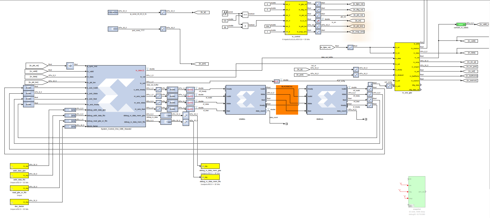
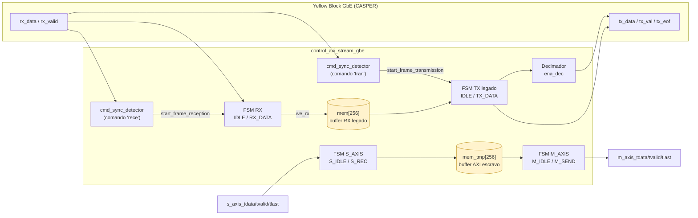
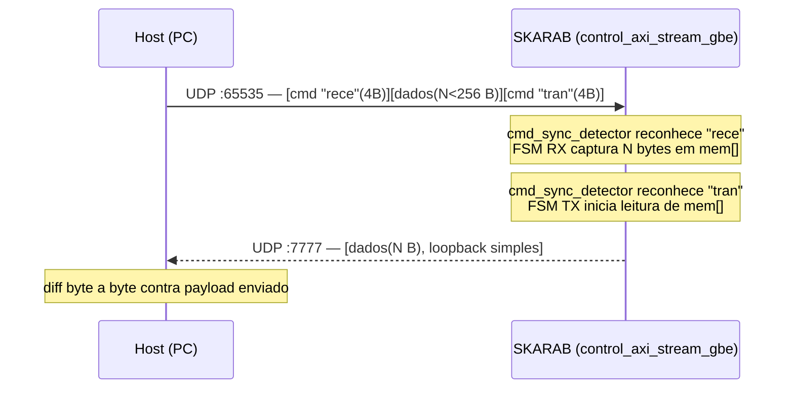
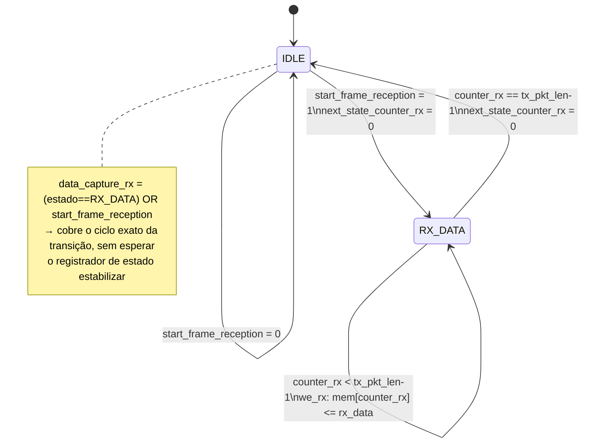
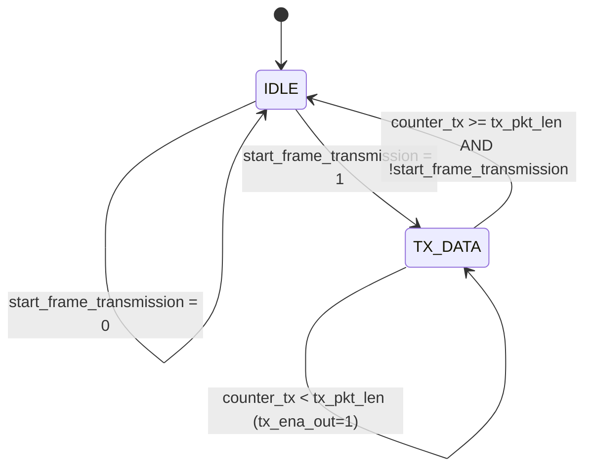
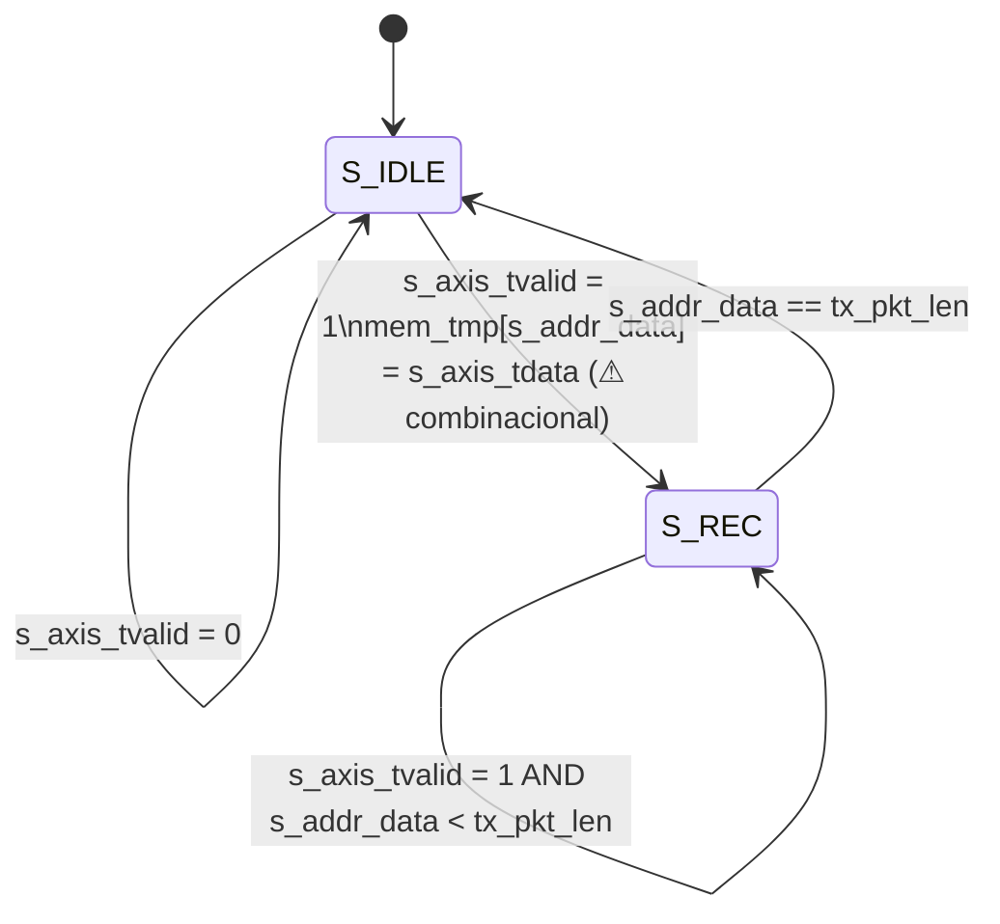
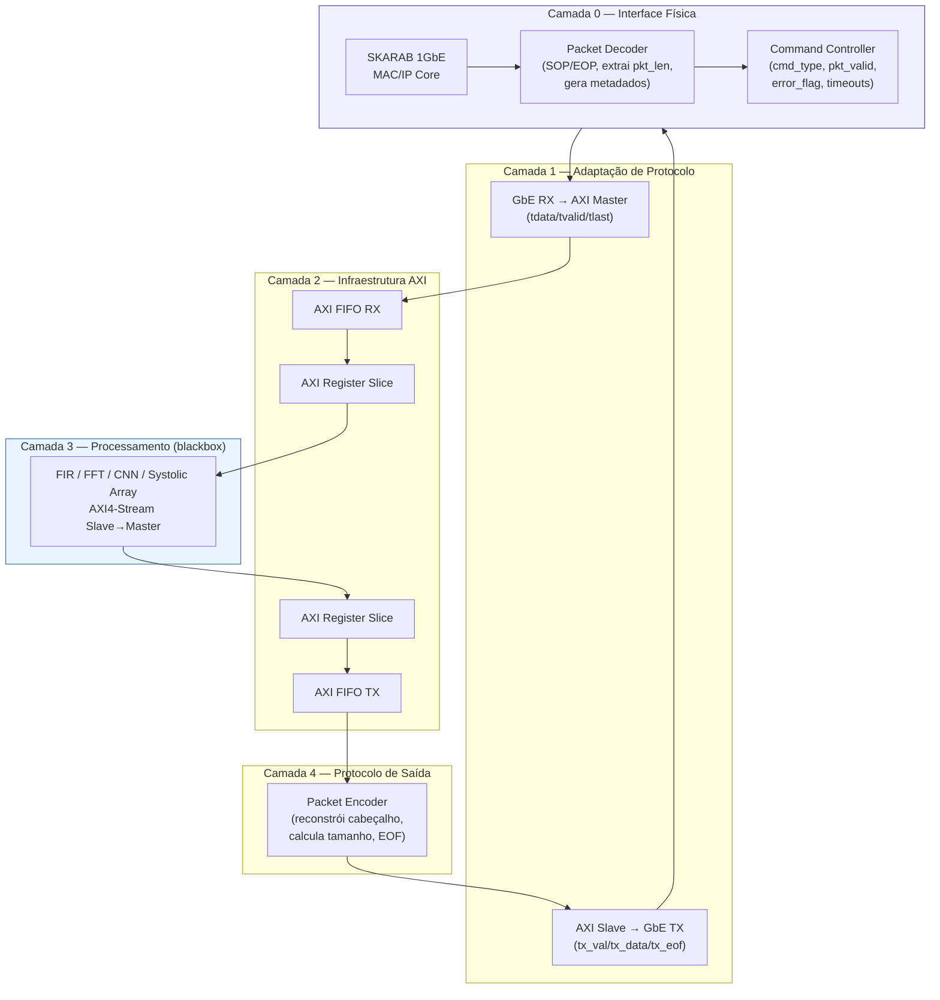
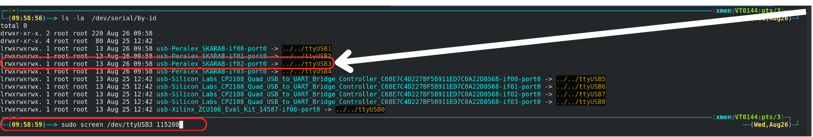
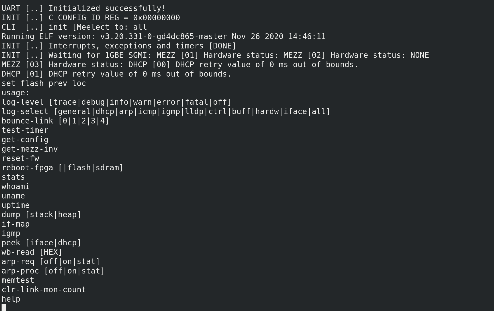

# skarab-virtex7-toolflow

# Unidade de Controle para a Interface Ethernet do Yellow Block da CASPER
**Orientação:** Prof. Dr. Gutemberg Gonçalves dos Santos Júnior


**VIRTUS/UFCG** — Engenheiro: Valmir F. Silva

**XMEN/UFCG** — Engenheiro: Marcos Antônio I. Luz


**Plataforma alvo:** SKARAB (Square Kilometer Array Reconfigurable Application Board), ecossistema CASPER

**Contexto:** módulo de controle da interface GbE de gerenciamento, atuando como canal auxiliar de comando/dados entre host (PC) e FPGA, complementar ao caminho de processamento de sinal de alta velocidade (10/40GbE).


---

## 1. Visão geral

Este módulo (`control_axi_stream_gbe`) implementa a lógica de captura, buffer e retransmissão de pacotes recebidos via um yellow block Ethernet da CASPER, expondo uma interface AXI4-Stream (mestre e escrava) para integração com o restante do pipeline de processamento no Simulink/toolflow CASPER.

O objetivo é servir como **canal de controle/eco de teste**, permitindo:
- Validar a infraestrutura de comunicação host↔FPGA antes de acoplar um acelerador real (FIR, FFT, correlator, etc.);
- Fornecer visibilidade de debug (leitura direta do conteúdo do buffer via registradores CASPER);
- Servir de base para uma futura unidade de controle **genérica**, capaz de operar tanto sobre o yellow block de 1GbE (gerenciamento) quanto sobre 10/40GbE (dados de alta velocidade), tratando ambos sob o mesmo contrato AXI4-Stream.

- Diagrama de arquitetura proposta (camadas: Interface Física → Adaptação de Protocolo → Infraestrutura AXI → Processamento → Protocolo de Saída) — documento de arquitetura de destino de médio prazo.
- `cmd_sync_detector` — submódulo de detecção de comando por casamento de padrão de 4 bytes (não incluído neste README; ver arquivo-fonte para detalhes de timing de `event_cmd_out`).

<p align="center">

</p>


### Diagrama de blocos funcional (estado atual)



> Os dois buffers (`mem`, `mem_tmp`) e os quatro caminhos de dado (RX legado, TX legado, AXI escravo, AXI mestre) coexistem hoje sem arbitragem explícita entre si — ver pendências em §8 (migração para FIFO).

---

## 2. Topologia de rede do ambiente de teste

| Sentido | IP | Porta |
|---|---|---|
| PC → SKARAB (TX host / RX FPGA) | `10.42.0.200` | `65535` |
| SKARAB → PC (TX FPGA / RX host) | `10.42.0.31` | `7777` |



---

## 3. Código-fonte do módulo (RTL completo, pós Revision 0.03)

> **Premissa crítica de projeto:** `rx_valid` é um sinal de **nível**, não de pulso — permanece em `1` continuamente do primeiro byte do comando até o último byte do payload (padrão MII/GMII/AXI-Stream convencional), com 1 byte novo em `rx_data` a cada ciclo de clock enquanto ativo. Essa premissa foi confirmada empiricamente após diagnóstico em hardware (ver §6) e é a base de toda a lógica de captura. **Não assumir pulso de 1 ciclo por byte.**

```v

```

---

### Diagramas de estado das FSMs

**FSM de recepção (`current_state_rx`)** — o núcleo da correção da Revision 0.03:



**FSM de transmissão legada (`current_state_tx`):**



**FSM da interface AXI-Stream escrava (`s_axis_state`)** — caminho ainda **não** corrigido com a mesma unificação do RX (ver §8):



### Linha do tempo ciclo a ciclo — bug corrigido na Revision 0.03

Ilustra o problema do byte descartado quando o avanço do contador e a condição de escrita não estavam unificados (resolvido pelo sinal `we_rx`):

```mermaid
gantt
    dateFormat X
    axisFormat %L
    section rx_data
    0x72 (cmd) :done, 0, 1
    0x29 (payload[0]) :active, 1, 2
    0x2a (payload[1]) :crit, 2, 3
    0x2b (payload[2]) :active, 3, 4
    section data_capture_rx (antes da correção)
    0 :done, 0, 1
    1 (start_frame_reception) :active, 1, 2
    0 - LACUNA, byte perdido :crit, 2, 3
    1 (current_state_rx==RX_DATA) :active, 3, 4
    section mem[] escrito (antes)
    - :done, 0, 1
    mem[0]=0x29 :active, 1, 2
    (nada — 0x2a perdido) :crit, 2, 3
    mem[1]=0x2b :active, 3, 4
```



Após unificar `we_rx = pulse_rx_valid && data_capture_rx` controlando **simultaneamente** o avanço de `counter_rx` e a escrita em `mem[]`, o índice nunca mais avança sem escrever (nem escreve sem avançar) — eliminando estruturalmente essa classe de bug, independentemente de eventuais lacunas remanescentes em `data_capture_rx`.

O payload trocado entre host e FPGA segue o formato:

```
[ COMANDO_DE_RECEPÇÃO (4 bytes) ] [ DADOS (N bytes, N < 256) ] [ COMANDO_DE_ENVIO (4 bytes) ]
```

- `COMANDO_DE_RECEPÇÃO` e `COMANDO_DE_ENVIO` são sequências fixas de 4 bytes ASCII, reconhecidas por casamento de padrão (`cmd_sync_detector`), hardcoded no RTL e ajustáveis conforme a aplicação:
  - Recepção: `0x72_65_63_65` (**"rece"**)
  - Transmissão: `0x74_72_61_6E` (**"tran"**)
- Os comandos são **descartados** após consumidos pela unidade de controle — não aparecem no eco de retorno.
- Em loopback simples, o retorno FPGA→host contém **apenas os dados**, sem os comandos de controle.

### Sobre o empacotamento de 8 bytes por elemento (lado host)

O script de teste em Python empacota cada byte lógico de dado como um inteiro de 64 bits (`struct.pack('>{N}Q', ...)`). **Isso é uma escolha do script de host, não um requisito de hardware** — o barramento real da FPGA (`rx_data[7:0]`) consome 1 byte por ciclo. O padrão `Q` (8 bytes, `unsigned long long`) foi usado por simplicidade de alinhamento no socket UDP; apenas o byte de menor ordem de cada palavra de 64 bits chega a ter significado no lado FPGA. Isso deve ser revisitado ao migrar para pacotes de tamanho maior, pois infla o payload de rede em 8×.

Para um pacote de 256 elementos (256 dados + 8 de comando = 264 elementos), o tamanho real transmitido no socket é `264 × 8 = 2112 bytes`; o retorno em loopback simples (só dados, sem comandos) é `256 × 8 = 2048 bytes`.

### Exemplo de montagem do pacote (arrays de referência em C)

```c
char frame_rx_64[] = {
  0x00, 0x00, 0x00, 0x00, 0x00, 0x00, 0x00, 0x6E, // [0] = 'n'
  0x00, 0x00, 0x00, 0x00, 0x00, 0x00, 0x00, 0x61, // [1] = 'a'
  0x00, 0x00, 0x00, 0x00, 0x00, 0x00, 0x00, 0x72, // [2] = 'r'
  0x00, 0x00, 0x00, 0x00, 0x00, 0x00, 0x00, 0x74, // [3] = 't'
};
char frame_dara_64[] = {
  0x00, 0x00, 0x00, 0x00, 0x00, 0x00, 0x00, 0x11, // [4] = "DADO"
  0x00, 0x00, 0x00, 0x00, 0x00, 0x00, 0x00, 0x11, // [5] = "DADO"
  0x00, 0x00, 0x00, 0x00, 0x00, 0x00, 0x00, 0x11, // [6] = "DADO"
  // ...
  0x00, 0x00, 0x00, 0x00, 0x00, 0x00, 0x00, 0x11, // [255] = "DADO"
};
char frame_tx_64[] = {
  0x00, 0x00, 0x00, 0x00, 0x00, 0x00, 0x00, 0x65, // frame_tx[256] = 'e'
  0x00, 0x00, 0x00, 0x00, 0x00, 0x00, 0x00, 0x63, // frame_tx[257] = 'c'
  0x00, 0x00, 0x00, 0x00, 0x00, 0x00, 0x00, 0x65, // frame_tx[258] = 'e'
  0x00, 0x00, 0x00, 0x00, 0x00, 0x00, 0x00, 0x72, // frame_tx[259] = 'r'
};
```

### Limite de tamanho atual

A versão atual suporta pacotes com `N < 256` (limitado pela profundidade fixa dos buffers `mem`/`mem_tmp`, de 256 posições × 8 bits). A expansão natural — necessária para suportar tamanho de pacote arbitrário — é **redirecionar o fluxo de dados diretamente pelas FIFOs dedicadas do projeto Simulink** (ver §8, Roadmap), eliminando o buffer endereçado fixo em favor de um pipeline `tvalid`/`tready`/`tlast` desacoplado de qualquer limite de profundidade fixa.

---

## 5. Registradores CASPER (`casperfpga`)

Registradores CASPER seguem duas direções:
- **"To Processor"** — FPGA → host, somente leitura pela `casperfpga`/API de controle.
- **"From Processor"** — host → FPGA, somente escrita pela `casperfpga`/API de controle.

### Registradores de controle

| Nome | Direção | Valor atual / observações |
|---|---|---|
| `pkt_len` | To Processor | Máximo atualmente suportado: 256 |
| `dec_factor` | From Processor | Fator de decimação da taxa de TX |
| `read_gbe_or_fifo` | From Processor | `1` = lê memória do bloco Ethernet (`mem`), `0` = lê cadeia de FIFOs (`mem_tmp`) |

### Registradores de debug

| Nome | Direção |
|---|---|
| `addr_data_gbe` | From Processor |
| `addr_data_fifo` | From Processor |
| `debug_rx_data_mem_gbe` | To Processor |
| `debug_rx_data_mem_fifo` | To Processor |

---

## 6. Histórico de revisões

### Revision 0.01 — Criação do arquivo

### Revision 0.02 — Correção do byte perdido na transição IDLE→RX_DATA
Causa raiz identificada na época: captura do primeiro byte de dado perdida na transição de estado, causando vazamento do byte `0x6E`/110 residual de `frame_rx` para dentro de `mem[]` (observado nos índices 246/247). **Nota histórica:** essa correção não se manteve — o mesmo sintoma reapareceu em bring-up posterior, motivando a Revision 0.03. Isso reforça a necessidade dos testes de regressão automatizados descritos em §7.

### Revision 0.03 — Correção definitiva: perda de bytes na captura de RX
**Causa raiz:** suposição incorreta de que `rx_valid` era um sinal **pulsante** (1 ciclo por byte). Na realidade, `rx_valid` é um sinal de **nível** (ver premissa em §3), padrão convencional em MII/GMII/AXI-Stream.

Essa suposição errada causou três sintomas em cadeia, descobertos e corrigidos nesta ordem:

1. **Detector de borda** (`rx_valid && ~rx_valid1`) capturava apenas o primeiro byte do frame, travando o contador pelo resto do quadro (porque `rx_valid` nunca "descia" durante o frame).
2. Ao trocar para nível puro (`pulse_rx_valid = rx_valid`), o **contador de endereço** (`counter_rx`) e a **condição de escrita** (`data_capture_rx`) passaram a avançar de forma dessincronizada: o índice avançava mesmo em ciclos em que a FSM ainda não permitia escrita (transição `IDLE`→`RX_DATA`), descartando silenciosamente 1–2 bytes no início de cada frame.
3. O mesmo padrão deixava **lixo residual** do frame anterior (bytes do comando `"tran"`/`"rece"`, ex. `0x6E`/`0x61`) em `mem[0]` e no último índice do buffer.

**Correção aplicada:**
- `next_state_counter_rx` passou a ser `0` (não `1`) na transição `IDLE`→`RX_DATA`, corrigindo o offset base.
- `data_capture_rx` passou a incluir `start_frame_reception` diretamente via OR combinacional, cobrindo o ciclo exato do pulso de início de frame sem esperar a FSM estabilizar em `RX_DATA`.
- **Unificação do avanço do contador e da escrita em memória sob um único enable** — a mudança estrutural mais importante:
  ```verilog
  wire we_rx = pulse_rx_valid && data_capture_rx;
  wire tkt_eof_rx = (counter_rx == tx_pkt_len - 1);

  if (we_rx) begin
      counter_rx      <= !tkt_eof_rx ? counter_rx + 1'b1 : 8'h00;
      mem[counter_rx] <= rx_data;
  end
  ```
  Isso elimina de forma estrutural a possibilidade do índice avançar sem escrever (ou escrever sem avançar) — a causa raiz do sintoma (2), e o tipo de bug mais difícil de prevenir por revisão de código isolada.

**Validação:** confirmada em hardware (SKARAB) com:
- Payload em rampa incremental (0..255), 256 bytes exatos = limite de `mem[]` — eco bateu byte a byte sem offset, lixo ou duplicação.
- Onda triangular com valores repetidos consecutivos, tamanhos 256 / 128 / 64 bytes — eco bateu byte a byte em todos os casos.
- Sequência de 353 pacotes UDP consecutivos, sem reset entre frames — zoom em 4 pacotes sequenciais confirmou continuidade perfeita nas fronteiras entre pacotes, sem descontinuidade, salto ou lixo residual.

---

## 7. Metodologia de teste (recomendada para qualquer alteração futura)

O processo que revelou e validou as correções acima, e que deve ser reaplicado a qualquer mudança neste módulo:

1. **Payload não-trivial.** Nunca testar com valor constante (ex. `[5,5,5,...]`) — usar rampa incremental (`byte[i] = i % 256`) ou onda com valores repetidos consecutivos. Payload constante mascara offset e duplicação em qualquer posição que não seja a borda do frame.
2. **Diff automático**, não inspeção visual de log:
   ```python
   diffs = [(i, s, r) for i, (s, r) in enumerate(zip(sent, recv)) if s != r]
   ```
3. **Cobertura de tamanhos de frame**: mínimo (poucos bytes), intermediário, e o limite superior do buffer (256), sem reset entre execuções.
4. **Sequência longa sem reset** entre frames, para expor lixo residual entre pacotes (visualização de "zoom em N pacotes sequenciais" com marcação de fronteira é especialmente eficaz).
5. **Waveform/ILA nos sinais mínimos para diagnosticar FSM de RX**: `current_state_rx`, `counter_rx`, `rx_data`, `rx_valid`, `start_frame_reception`, e um sinal explícito de write-enable (`we_rx`) — sem esses, qualquer bug de offset de 1 ciclo é quase impossível de diagnosticar por inspeção de código isolada.

---

## 8. Pendências e roadmap

### Arquitetura de destino em camadas (visão de médio prazo)



**Mapeamento do estado atual deste módulo contra as camadas:**

| Camada | Situação atual |
|---|---|
| 0 — Packet Decoder + Command Controller | Parcial: `cmd_sync_detector` só reconhece padrão fixo de 4 bytes; sem extração dinâmica de `pkt_len`, sem `error_flag`, sem timeout |
| 1 — Bridge GbE↔AXI-Stream | Parcial: interface AXI-Stream mestre/escrava existe, mas convive com caminho legado (`rx_data`/`tx_data`) sobre os mesmos buffers, sem bridge isolada |
| 2 — FIFO RX/TX + Register Slice | Não implementada: `mem`/`mem_tmp` são buffers endereçados fixos (256), não FIFOs de handshake `tvalid`/`tready` — migração planejada (ver abaixo) |
| 3 — Hardware Accelerator | Não iniciada: módulo atual é passthrough/eco, sem processamento real acoplado |
| 4 — Packet Encoder | Não implementada: retorno é eco cru do buffer, sem reconstrução de cabeçalho |

### Pendente — não coberto pela Revision 0.03

- **Profundidade de `mem[]`/`mem_tmp[]` (256) vs. largura de `tx_pkt_len`/contadores (10 bits, até 1023):** sem proteção contra estouro se `tx_pkt_len > 256`. Mitigação temporária: clamp/saturação em `tx_pkt_len`. Mitigação definitiva: migração para FIFO (ver abaixo).
- **Off-by-one no decimador (`ena_dec`):** `counter_dec` avança até `decim_factor`, não `decim_factor-1`, alongando o período real de decimação em 1 ciclo.
- **Escrita combinacional em `mem_tmp[]`** dentro de `always@(*)` na interface AXI escrava (`S_IDLE`/`S_REC`): mesmo padrão de risco já corrigido no caminho RX legado (item 2 da Rev. 0.03), ainda não revisado no caminho AXI-Stream escravo. **Maior prioridade entre os pendentes** — mesma classe de bug já conhecida, caminho ainda não exercitado por nenhum teste realizado até o momento.
- **Caminho de transmissão** (`tx_data`/`tx_val`/`counter_tx`) ainda usa a estrutura antiga, sem a unificação contador+escrita aplicada no RX; não testado com o mesmo rigor do §7.

### Migração planejada: eliminação de `mem`/`mem_tmp` em favor de FIFOs dedicadas

Decisão de arquitetura: **remover os buffers endereçados fixos e redirecionar o fluxo de dados diretamente para as FIFOs AXI-Stream do projeto Simulink** (ex. `axis_data_fifo_0`), tornando o suporte a tamanho de pacote genuinamente flexível (não mais limitado a `N < 256`).

O que essa mudança resolve de graça:
- Elimina a limitação de profundidade fixa (256).
- Elimina toda a classe de bug "contador dessincronizado da condição de escrita".
- Elimina lixo residual entre frames (FIFO vazia não retém estado de endereço).

Novo ponto crítico a validar após a migração:
- Handshake `tvalid`/`tready` rigorosamente correto nas duas pontas (mesmo cuidado que resolveu `we_rx`, agora aplicado ao consumo da FIFO).
- Geração de `tlast`/EOF sem depender de contagem de endereço fixo.
- Interação com a FIFO IP real (`axis_data_fifo_0`) — validar isoladamente antes de integrar ao pipeline completo.

### Objetivo de médio prazo: unidade de controle genérica (1GbE / 10-40GbE)

Meta: tratar o yellow block de gerenciamento (1GbE) e o(s) yellow block(s) de dados de alta velocidade (10/40GbE) sob o mesmo contrato interno AXI4-Stream, isolando toda diferença de PHY em adaptadores finos e substituíveis.

Diferenças de hardware que **não** podem ser abstraídas e exigem tratamento explícito por adaptador:
- **Largura de dado por ciclo:** 1GbE entrega 1 byte/ciclo; 10/40GbE tipicamente entrega múltiplos bytes/ciclo — requer parametrizar `DATA_WIDTH` ou inserir width converter.
- **Cruzamento de domínio de clock real:** os cores 10/40GbE do CASPER rodam a 156,25MHz, dissociado do clock de sistema do design — exige FIFO dual-clock genuína na fronteira (diferente do caso 1GbE atual, onde CDC foi descartado como causa dos bugs corrigidos na Rev. 0.03).
- **Backpressure e overflow:** taxas de 10/40GbE tornam overflow de buffer uma preocupação real de throughput, não apenas teórica.

Do lado host, a convenção CASPER já separa naturalmente os dois papéis — modelo a ser espelhado:
- **`casperfpga`** → canal de controle/gerenciamento (registradores, configuração de core, contadores de status).
- **Socket UDP padrão** → canal de dados (pacotes Ethernet/IP/UDP reais, sem necessidade de biblioteca proprietária no lado do host).

### Nota sobre reaproveitamento de infraestrutura CASPER

Os yellow blocks de GbE do CASPER já resolvem (de forma testada pela comunidade) responsabilidades que este módulo hoje implementa manualmente: framing Ethernet/IPv4/UDP, resolução ARP, checksum, e sincronização de domínio de clock. Antes de expandir o RTL manual desta unidade além do necessário para o canal de controle 1GbE, avaliar se a complexidade de dados de alta velocidade (10/40GbE) deveria ser delegada ao yellow block correspondente, reservando RTL manual para a camada de acelerador (Camada 3 de uma arquitetura em pipeline: FIR/FFT/correlator), que é onde o valor científico do projeto de fato reside.

---

## 9. Scripts de teste (host)

### 9.1 Controle via `casperfpga` (Python 2.7)

Programa o `.fpg`, configura `tx_control` (tamanho de pacote, enable, reset), seleciona fonte de leitura de debug (`read_gbe_or_fifo`), ajusta decimação a partir do clock estimado da FPGA, e varre as memórias de debug (`addr_data_gbe`/`debug_rx_data_mem_gbe`, `addr_data_fifo`/`debug_rx_data_mem_fifo`) para inspeção byte a byte via registrador.

> **Nota de manutenção:** ambiente depende de `casperfpga` compatível com Python 2.7 (`virtualenv` dedicado). Vale avaliar migração para uma versão mais recente de `casperfpga` compatível com Python 3, dado que o ecossistema CASPER já migrou oficialmente para Python 3 nas versões atuais da biblioteca.

```python
#!/usr/bin/env python2
"""
Script de teste do SKARAB (loopback / FIFO / AXI ethernet_one_gbe).

Ativar o virtualenv antes de rodar:
    source $HOME/teste_ska/skarab_py27/bin/activate
"""

import time
from random import randint

import casperfpga

# ---------------------------------------------------------------------------
# Configuração
# ---------------------------------------------------------------------------

FPGA_IP = '10.42.0.200'

# .fpg mais recente em uso (histórico de builds antigos removido).
# Para testar outro build, basta trocar este caminho.
FPG='/home/valmyrsilva07/virtex7/skarab-virtex7-toolflow/fpgs/ethernet_one_gbe_skarab_control/ethernet_one_gbe_skarab_axi/outputs/ethernet_one_gbe_skarab_axi_2026-08-05_1103.fpg'

LOOPBACK_SIMPLES =not(bool("loop" in FPG))
PKT_LEN = 256


CONTROL_GBE_OR_FIFO_MEM_READ = 'read_gbe_or_fifo'
ADDR_GBE = 'addr_data_gbe'
ADDR_FIFO = 'addr_data_fifo'
DATA_GBE = 'debug_rx_data_mem_gbe'
DATA_FIFO = 'debug_rx_data_mem_fifo'
RATE = 2  # usado no cálculo de decimação

fpga = casperfpga.CasperFpga(FPGA_IP)


# ---------------------------------------------------------------------------
# Funções auxiliares
# ---------------------------------------------------------------------------

def debug_mem(addr, mem, start=0, stop=256):
    """Varre a memória de debug endereço a endereço e imprime os valores."""
    for i in range(start, stop):
        fpga.write_int(addr, i)
        print("mem[", fpga.read_int(addr), "]", "=", fpga.read_int(mem))


def debug_mem_plot(addr, mem, start=0, stop=256):
    """Igual a debug_mem, mas retorna os dados em uma lista (para plot)."""
    data = []
    for i in range(start, stop):
        fpga.write_int(addr, i)
        data.append(fpga.read_int(mem))
    return data


def control_fan(pwm=30):
    """Ajusta a velocidade das 5 ventoinhas do SKARAB."""
    for i in range(5):
        print(fpga.transport.set_fan_speed(fan_page=i, pwm_setting=pwm, timeout=1))


# ---------------------------------------------------------------------------
# Execução
# ---------------------------------------------------------------------------

def main():
    control_fan(pwm=randint(0, 4) + 1)

    fpga.upload_to_ram_and_program(FPG)
    if(LOOPBACK_SIMPLES):
        # Tamanho do pacote a ser transmitido
        fpga.registers.tx_control.write(pkt_len=PKT_LEN)
        # Habilita transmissão e reseta o core de ethernet
        fpga.registers.tx_control.write(tx_en=1, pkt_rst="pulse")
        fpga.registers.tx_control.write(pkt_rst="pulse")
        # Seleciona a fonte de dados a ser lida (GbE ou FIFO)
        fpga.write_int(CONTROL_GBE_OR_FIFO_MEM_READ, 0)  # 1 = GbE, 0 = FIFO
        # Decimação a partir do clock estimado da FPGA
        clk_ghz = fpga.estimate_fpga_clock() / 1000
        dec_dactor = int((clk_ghz * 256.0 / RATE) + 1)
        fpga.registers.dec_dactor.write(reg=4)
        # Leitura das memórias de debug
        debug_mem(ADDR_GBE, DATA_GBE, start=0, stop=256)
        debug_mem(ADDR_FIFO, DATA_FIFO, start=0, stop=256)


if __name__ == '__main__':
    main()

# ---------------------------------------------------------------------------
# Plot ao vivo (opcional) — descomente para visualizar addr_gbe em tempo real
# ---------------------------------------------------------------------------
# from matplotlib import pyplot as plt
# fig, ax = plt.subplots(figsize=(12, 4))
# while True:
#     plt.ion()
#     ax.cla()
#     data = debug_mem_plot(ADDR_GBE, DATA_GBE, start=0, stop=256)
#     print(data)
#     ax.plot(data, color='red')
#     ax.set_ylim(0, 256)
#     plt.pause(1e-17)

""""

RATE = 10
clk_ghz = fpga.estimate_fpga_clock() / 1000
dec_dactor = int((clk_ghz * 256.0 / RATE) + 1)
fpga.registers.dec_dactor.write(reg=dec_dactor)


"""
```

### 9.2 `tx_host.py` — gerador de payload / envio ao SKARAB

Monta o pacote `[comando_tx][dados][comando_rx]`, empacota como inteiros de 64 bits (ver nota §4) e envia via socket UDP. Payload de dados atualmente gerado como onda senoidal parametrizável (`f1`, `fs`, offset `k` incremental por iteração) — recomenda-se alternar para rampa incremental pura ao investigar bugs de offset/duplicação (ver §7).

```python
#////////////////////////////////////////////////////////////////////////////////
# Company: VIRTUS/UFCG
# Engineer: Valmir F. Silva 
# 
# Create Date: 06/25/2026 00:20:32 AM
# Design Name: 
# Module Name: tx_host
# Project Name: 
# Target Devices: 
# Tool Versions: 
# Description: 
# 
# Dependencies: 
# 
# Revision:
# Revision 0.01 - File Created
# Additional Comments:
# 
#////////////////////////////////////////////////////////////////////////////////


import socket
import time
import numpy as np
import struct
import os
from random import randint
from matplotlib import pyplot as plt

DEBUG = True


SERVER_IP = "10.42.0.200"
SERVER_PORT = 65535

IP = "10.42.0.31"
PORT = 7777


MESSAGE = bytes([0x01] * 32)

sock = socket.socket(socket.AF_INET, socket.SOCK_DGRAM)
fs=10e+3
f=78

#sock = socket.socket(socket.AF_INET, socket.SOCK_DGRAM)
#sock.bind((IP, PORT))
N= 256


frame_rx = np.array(([0x6E,0x61,0x72,0x74]),dtype=np.int8)
frame_tx = np.array(([0x65,0x63,0x65,0x72]),dtype=np.int8)


f1=1000
f2=1000
f3=700
fs=10e+4
t = np.arange(0,N,1)


data1=np.arange(start=0,stop=N,dtype=np.int64)+   3
#data1=np.ones(N-8,dtype=np.int64)*35
data2 =np.concatenate((data1[0:128],frame_rx,data1[0:128],frame_tx))
t = np.arange(0,N,1)
data =(data2).tolist()
data3 =(np.ones(N,dtype=np.int64)).tolist()
#data =(narange(start=0,stop=N,dtype=np.int64)).tolist()
print(len(data))

k=3

t0 = time.time()
try:
    t0 = time.time()

    while(True):
        data1 = (np.round(2**4 * np.sin(2 * np.pi * (f1 / fs) * t) + 2**4+k ).astype(np.int64))
        #data1 = np.ones(N,dtype=np.int64)*k#np.arange(0,N,1,dtype=np.int64)+1 # de 1 a 255
        #data1 = np.mod(data1, N).astype(np.int64)
        #data1[N-1] = 0xcc
        #data1 = np.arange(0,N,dtype=np.int64)
        data   =np.concatenate((frame_tx,data1,frame_rx))
        data_pack = struct.pack(f'>{N+8}Q', *data.tolist())
        sock.sendto(data_pack, (SERVER_IP, SERVER_PORT))
        #data, addr = sock.recvfrom((N)*8)  # Buffer de 2048 bytes
        #array_d = struct.unpack(f'>{N}Q',data)

        if(DEBUG):
            for i in range(0,N+8):
                print(f"\033[91m PC \033[00m -> \033[92m FPGA \033[00m:Word[{i}]={data[i]}")
            print("============================Enviado=====================",k)
        k+=1
        if(k >=256-2*2**4): k =0
        time.sleep(0.01)
except KeyboardInterrupt:
    print("Finalizado pelo usuário")

finally:
    sock.close()
```

### 9.3 Script de recepção/plot ao vivo

Escuta em `10.42.0.31:7777`, desempacota o payload (`struct.unpack('>{N}Q', ...)`) e plota em tempo real via `matplotlib` com blitting (atualização parcial de canvas para performance). Mantém apenas o pacote mais recente do buffer de recepção a cada iteração de loop (`ultimo_pacote`), descartando pacotes intermediários se a taxa de chegada exceder a taxa de plot.

```python
import socket
import struct
import numpy as np
from matplotlib import pyplot as plt
from random import randint
DEBUG = False

N=256
SAMPLES = N
IP = "10.42.0.31"
PORT = 7777
sock = socket.socket(socket.AF_INET, socket.SOCK_DGRAM)
sock.bind((IP, PORT))
sock.setblocking(False)
print(f"Escutando em {IP}:{PORT}")

fig, ax = plt.subplots(figsize=(12, 4))
ax.set_title("e^At*sint(Bt)")
ax.set_ylim(0, 256)

x = np.arange(SAMPLES)
y0 = np.zeros(SAMPLES)
line, = ax.plot(x, y0, color='red')

rodando = True
def ao_fechar(event):
    global rodando
    rodando = False
fig.canvas.mpl_connect('close_event', ao_fechar)

plt.show(block=False)
fig.canvas.draw()  # desenha o "fundo" (título, eixos, grade) uma vez

# guarda uma cópia do fundo limpo, sem a linha
background = fig.canvas.copy_from_bbox(ax.bbox)

PKT_SIZE = SAMPLES * 8
j = 0

while rodando:
    ultimo_pacote = None
    while True:
        try:
            data, addr = sock.recvfrom(PKT_SIZE)
            ultimo_pacote = data
        except BlockingIOError:
            break

    if ultimo_pacote is None:
        fig.canvas.flush_events()
        continue

    array_d = struct.unpack(f'>{N}Q', ultimo_pacote)

    # 1. restaura o fundo limpo (isso "apaga" a linha anterior)
    fig.canvas.restore_region(background)

    # 2. atualiza os dados da linha
    line.set_ydata(array_d)

    # 3. redesenha só a linha sobre o fundo restaurado
    ax.draw_artist(line)

    # 4. manda pra tela só a região que mudou
    fig.canvas.blit(ax.bbox)
    fig.canvas.flush_events()

    if DEBUG:
        print(j, "recebido")
    j += 1
```

---

## 10. Referências internas


## Comandos úteis

> **Adapte `<interface>`, `<IP>` e demais parâmetros à configuração do seu sistema.**


### UART

```bash
# Listar UARTs disponíveis
ls -la /dev/serial/by-id/
```
<p align="center">

</p>

```bash
sudo screen /dev/ttyUSB3 115200
```

Para listar as opções disponíveis: ?

<p align="center">

</p>

### Rede

```bash
# Identificar interfaces
ip -br link

# Configurar conexão Ethernet
sudo nmcli con add type ethernet ifname <interface> \
    con-name skarab-direct ipv4.method shared ipv6.method disabled

sudo nmcli con up skarab-direct

# Adicionar IP de recepção
sudo ip addr add <IP>/<prefixo> dev <interface>

# Verificar configuração
ip -br addr
```

**Exemplo:**

```bash
sudo ip addr add 10.42.0.31/24 dev enp4s0
```


```bash
sudo ip link set dev enp4s0 mtu 9000
```

[Correção da API casperfpga para python2.7](https://youtu.be/omPAlH5oBUo?si=3I-0S11s5vJFtD_3).
